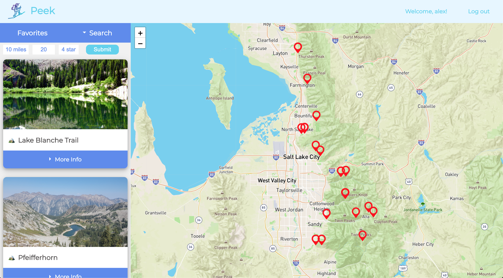
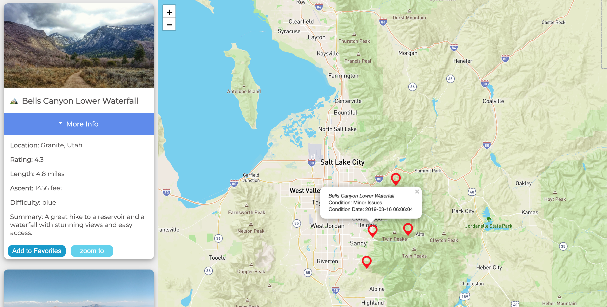

## Peek

<h3>An fullstack app to use skills learned for React and Redux. The user is able to log in or register, filter hikes based on their preferences, add them to their favorites, and visualize the hikes on a map.

The hiking trail data is limited to Salt Lake City and the surrounding area due to restrictions on the API.</h3>

## Demo

Demo the app and discover new hiking areas around Salt Lake City.

Register or Demo Login:

- username: demo
- password: demo123456

* https://peeks.herokuapp.com/

## Built with:

<h2>FrontEnd</h2>

- React
- Redux
- Leaflet-React
- MapBox
- JavaScript
- HTML / CSS
- Heroku

<h2>Testing</h2>

- Chai
- Chai-HTTP
- Mocha
- Travis
- Jest
- Enzyme

<h2>User Auth</h2>

- Bcryptjs
- JSON Web Token (JWT)
- Passport

<h2>Backend</h2>

- Express
- Mongoose
- Morgan
- MongoDB
- Atlas
- Cors

## Screenshots

<h2>Main Page</h2>

<h2>Register</h2>

<h2>Landing Page</h2>

<h2>Discover</h2>

<h2>Mobile</h2>

  
   

